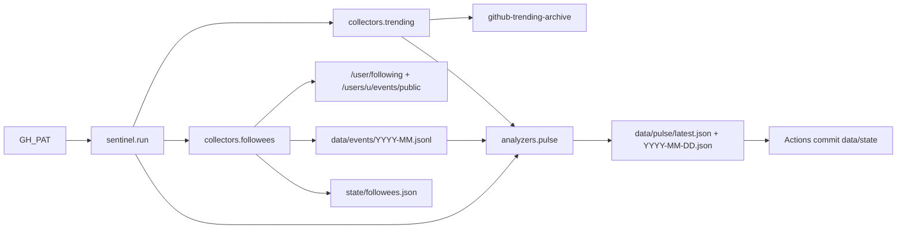
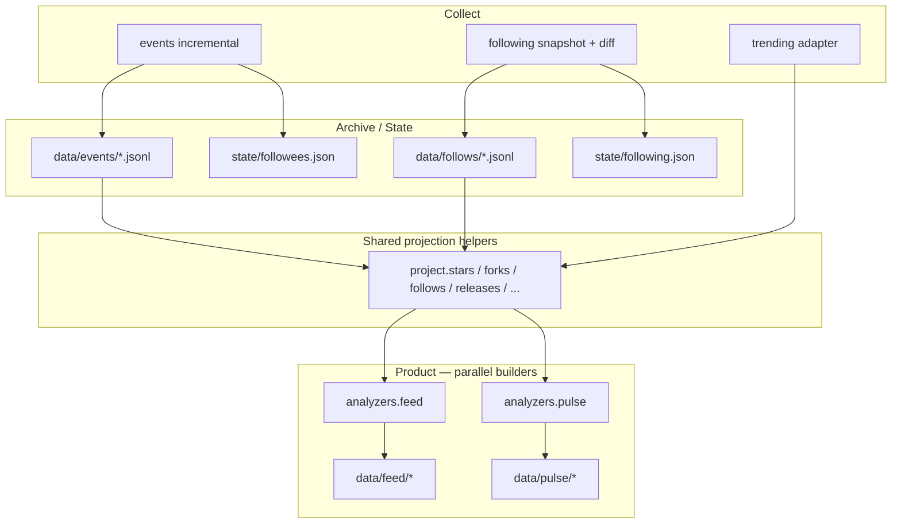
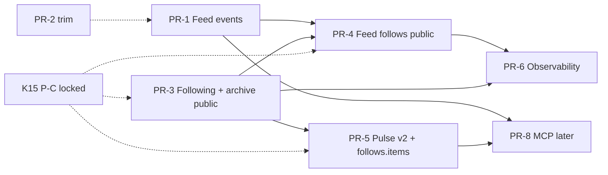

# Sentinel-gh：Followee Feed 与每日 Digest 产品设计

| 字段 | 值 |
| --- | --- |
| **Title** | Followee Feed + Daily Digest |
| **Author** | TBD |
| **Date** | 2026-07-12 |
| **Status** | Draft（review revision 3 — K13 full↔full only; privacy **P-C** locked） |
| **Repo** | ElectQ/Sentinel-gh (`/Users/sh1ne/Dev/Sentinel-gh`) |
| **Audience** | 熟悉本仓库的 senior engineers |

---

## Overview

Sentinel-gh 已能增量采集 followees 的公开 Events，并产出聚合 digest（`data/pulse/latest.json`：`circle_hot`、`trending_overlap`、`releases`、`new_repos`）。但与 GitHub Dashboard Feed 的产品目标相比，存在三道缺口：

1. **个体动态不可见**：单人 star/fork 只落在 raw archive 与 `raw_counts`；`circle_hot` 要求 ≥2 人，日常 5–50 次 star 大多“消失”在 digest 里。
2. **Follow 关系无法从 Events 获得**：归档中 **0 条 `FollowEvent`**；GitHub 多年前已从 public timeline 移除 FollowEvent。必须改用 **following 列表快照 + 日 diff**。
3. **噪声主导**：归档中约 **76% 为 `PushEvent`**，与 Dashboard 淡化 push 的呈现不一致。

本设计在**不推翻现有采集/状态/Actions 管道**的前提下，增加：

- **Following Diff Collector**：对每位 followee 做 `GET /users/{u}/following` 快照与日 diff，产出“新 follow / unfollow”（**仅 full↔full emit**，见 K13）。
- **Feed 契约**（新）：按时间序的高信号活动流（star / fork / follow / release / new_repo / …），作为“Feed-like”主表面。
- **Pulse 契约演进**（digest）：保留并增强聚合视图（`follows`、个体 `stars`/`forks`），与 Feed **共享投影 helper、并行构建**（非 feed→pulse 管道依赖）。
- 统一 **daily product surface**：下游只依赖稳定 JSON；后续 MCP 只是薄查询层。

**隐私决策（已锁定 K15 = P-C）**：仓库保持 **public**；**接受**将 follow 边时间序列写入公开产品面（`data/feed/*` 的 `kind=follow`、`data/pulse/*` 的 `follows.items`、`data/follows/*.jsonl`）。Owner 已知晓此为可爬取的「followee 新 follow 了谁」社交图时间线。残余风险与可选 kill-switch 见 Security。

---

## Background & Motivation

### 当前架构（已实现）



| 组件 | 路径 | 职责 |
| --- | --- | --- |
| 入口 | `src/sentinel/run.py` | 采集 → 归档 → trending → pulse |
| GH 客户端 | `src/sentinel/gh.py` | PAT、ETag 304、分页、限流退避 |
| Followee 事件 | `src/sentinel/collectors/followees.py` | 增量 events、`trim`、月度 jsonl |
| Trending | `src/sentinel/collectors/trending.py` | 第三方归档适配 |
| Pulse | `src/sentinel/analyzers/pulse.py` | `SCHEMA_VERSION = 1` 聚合 |
| 状态 | `state/followees.json` | 每用户 `etag` / `last_event_at` / `boundary_ids` |
| 工作流 | `.github/workflows/daily-pulse.yml` | UTC 22:00，`GH_PAT`，回写 `data/` + `state/` |

### 实证基线（2026-07 归档）

| 指标 | 值 |
| --- | --- |
| Followees | ~166 |
| 总事件样本 | 501（`2026-06` + `2026-07` jsonl） |
| `PushEvent` | 379（~75.6%） |
| `WatchEvent`（star） | 63 |
| `ForkEvent` | 9 |
| `FollowEvent` | **0** |
| 日事件量（`_collected_at` 日聚合） | 2026-07-09: **276**；10: 126；11: 99 |
| 日 star 数 | 50 / 8 / 5 |
| 日 `circle_hot` | 3 / 0 / 0 |
| 归档中 `CreateEvent` | 12 条，**全部** `ref_type=branch`；三日 pulse 的 `new_repos` 均为 `[]` |

结论：聚合 digest 在多数日子几乎为空壳；用户真正想看的“某人 star 了某仓 / 新 follow 了某人”需要 **Feed 层**。早期 Feed 价值将主要来自 **star / fork**（及后续 follow）；`new_repo`（`CreateEvent` + `ref_type==repository`）API 正确但在当前圈子里** empirically 稀少**，不应作为 v1 主卖点。

### 痛点

| 痛点 | 影响 |
| --- | --- |
| Pulse ≠ Feed | 无法“扫一眼圈子动态” |
| Follow 缺失 | 社交图谱信号断档，与 Dashboard 能力不对齐 |
| Push 噪声 | 若直接把 raw events 当 feed，信噪比极差 |
| 公开提交 | 仓库若 public，events/pulse 会暴露关注网络；**follow 边时间序列**与 following 全集快照均为社交图敏感产物 |

---

## Goals & Non-Goals

### Goals

1. **高信号 Feed**：每日产出可排序的活动项列表，覆盖 star、fork、follow（diff）、release、new repo；可扩展其它高信号类型。
2. **稳定产品契约**：JSON Schema + `schema_version`；`latest.json` 作为下游主入口；与现有 pulse 并存或清晰演进。
3. **复用现管道**：继续用 `GitHub` 客户端、`state/` 持久化、ETag 增量、daily Actions、事件 jsonl 归档；following 需 **小幅扩展** `gh.py`（见 API 节）。
4. **诚实处理 FollowEvent 缺失**：following 快照 diff；首跑建基线不刷屏；**仅 full↔full 才 emit 边**（截断侧零 emit，见 K13）；成本可量化、可降级。
5. **噪声策略**：Feed 默认排除 `PushEvent`；raw archive 不变，供审计与后续分析。
6. **限流安全**：在 ~5000 req/hr PAT 预算内完成 166 followees 的 events + following 采集。
7. **隐私策略明确（P-C）**：public 仓库下默认发布 follow 边；README 披露；可选 env 可临时关闭发布。
8. **同日重跑正确**：follow 与 events 一样，builder 只消费 **当日归档回放**，不单依赖本轮内存 diff。

### Non-Goals

- 实时/秒级 feed（仍是日批，UTC 22:00）。
- 完整复刻 GitHub 私有 Dashboard（含私有 repo 活动、Sponsors、内部未公开信号）。
- 自建 trending 爬虫（继续用 `antonkomarev/github-trending-archive`）。
- 本期交付 LLM 报告或 MCP server（Roadmap 保留；契约先稳）。
- 替换现有 events 归档格式。
- 精确到秒的 “follow 发生时间”（API 不提供；仅能得到日级窗口）。
- P-B 式「public 但不发布 follow」的完整 cache 隐私模式（P-C 已选定；PR-7 spike 仅在未来改策时需要）。

---

## Proposed Design

### 产品表面（Final Product Surface）

面向下游的**双契约、共享投影、并行构建**：

| 表面 | 路径 | 角色 |
| --- | --- | --- |
| **Feed**（新） | `data/feed/latest.json`、`data/feed/YYYY-MM-DD.json`、`data/feed/schema.json` | 时间序活动流；“像 Dashboard Feed” |
| **Pulse / Digest**（演进） | `data/pulse/latest.json` 等 | 聚合洞察：`circle_hot`、trending 交叉、follows 摘要 |
| **Raw events**（非契约） | `data/events/YYYY-MM.jsonl` | 全量裁剪后事件，含 Push |
| **Raw follows**（非契约，实现归档） | `data/follows/YYYY-MM.jsonl` | 当日 follow/unfollow diffs（含 `_collected_at`） |
| **Following state**（实现态） | `state/following.json` | 每人当前 following 集合 + ETag；**P-C 下默认入 git**（与 `followees.json` 相同，供 Actions 日批） |

下游推荐入口：

```
# Feed（主阅读面）
https://raw.githubusercontent.com/<owner>/Sentinel-gh/main/data/feed/latest.json

# Digest（聚合面）
https://raw.githubusercontent.com/<owner>/Sentinel-gh/main/data/pulse/latest.json
```



**原则（K1 / Issue 5）**：

- Feed 与 Pulse **共享纯函数投影**（例如 `project.iter_stars(day_events)`、`project.iter_follows(day_follows)`），各自独立 `build(...)`。
- **禁止** Pulse 依赖 Feed 的输出文件或 `feed_summary` 来决定 digest 内容（避免 `FEED_KINDS` 静默裁剪 pulse）。
- `feed_item_count` **可选**：仅当本 run 写了 feed 时填入；否则省略或 `null`，**不** required。

### 流水线变更（`run.py`）

演进后的日批顺序（**canonical path**，对齐 events 的 archive → `collected_on` 模式）：

1. `followees.collect` + `followees.archive(new_events)`（现有）
2. **`following.collect`** → 计算 diffs（含截断策略）→ **`following.archive(diffs)`** append `data/follows/YYYY-MM.jsonl`（稳定 id 去重见下）→ 更新 memory 中 following state
3. `state_mod.save` followees + following（**archive 成功后再 save**；见 State lifecycle）
4. `trending.fetch`（现有）
5. `today = UTC date`
6. **`day_events = followees.collected_on(today)`**（现有）
7. **`day_follows = following.collected_on(today)`**（新；按 id 去重）
8. `feed_mod.build(day_events, day_follows, trend, followee_count)` → 写 feed（若 `FEED_ENABLED`）
9. `pulse_mod.build(day_events, day_follows, trend, followee_count)` → 写 pulse v2（**不**传入 feed 对象作为内容源）

伪代码（对齐现有风格）：

```python
# src/sentinel/run.py (target shape)
def main() -> None:
    gh = GitHub()
    st_users = state_mod.load_followees()
    st_following = state_mod.load_following()

    followee_logins, new_events = followees.collect(gh, st_users)
    followees.archive(new_events)

    if env_bool("FOLLOWING_ENABLED", default=True):
        # mutates st_following; returns this-run diffs only (for logging)
        new_diffs = following.collect(gh, st_following, followee_logins)
        following.archive(new_diffs)  # append jsonl; internal dedupe by id
    else:
        new_diffs = []

    state_mod.save_followees(st_users)
    state_mod.save_following(st_following)

    trend = trending.fetch(gh)
    today = dt.datetime.now(dt.UTC).date().isoformat()
    day_events = followees.collected_on(today)
    day_follows = following.collected_on(today)  # REQUIRED replay path (K7/K14)

    if env_bool("FEED_ENABLED", default=True):
        feed = feed_mod.build(day_events, day_follows, trend, len(followee_logins))
        feed_mod.write(feed)
        feed_item_count = feed["item_count"]
    else:
        feed_item_count = None

    pulse = pulse_mod.build(
        day_events, day_follows, trend, len(followee_logins),
        feed_item_count=feed_item_count,  # optional sugar only
        following_enabled=env_bool("FOLLOWING_ENABLED", True),
    )
    pulse_mod.write(pulse)

    print(f"following this_run_diffs={len(new_diffs)} day_follows={len(day_follows)}")
    if gh.last_rate_limit_remaining is not None:
        print(f"rate_limit: remaining={gh.last_rate_limit_remaining}")
```

**同日重跑**：第二轮 `collect` 在 state 已更新后通常产生 **0** 条新 diff，但 `day_follows = collected_on(today)` 仍读回当日 jsonl → feed/pulse 的 follow 面完整（与 events 对称）。

### 1) Events 采集：保留 + 小幅增强

**保留**：

- `GET /users/{login}/events/public`，ETag + `last_event_at`（`followees.py`）
- 增量游标是 `created_at`，**不是 event id** —— id 按事件类型分号段，跨类型不可比（见 `tests/test_followees_watermark.py`）
- 同一秒的事件用 `boundary_ids` 去重，避免漏掉共享时间戳的兄弟事件
- `MAX_EVENT_PAGES = 3`，首跑 `FIRST_RUN_WINDOW_HOURS = 24`
- 月度 jsonl append；`trim()` 裁剪 payload

**增强 `trim()`**（为 Feed 丰富展示，向后兼容：只增字段）：

| type | 现有 payload | 建议补充 |
| --- | --- | --- |
| `WatchEvent` | `{}` | 无需额外（repo/actor 已够） |
| `ForkEvent` | `forkee` | 保持 |
| `ReleaseEvent` | tag/name/url/… | 保持 |
| `CreateEvent` | ref_type/ref | 保持；Feed 仅 `ref_type==repository`（**当前归档几乎无此类**） |
| `PublicEvent` | 未保留 | 可选：空 payload 即可（repo 公开） |
| `MemberEvent` | `{}` | 可选 `action`（若 API 有） |
| `PushEvent` | ref/size | **继续归档，不进 Feed** |

不必为 Feed 单独再请求 API；全部从已有 events 投影。

### 2) Following Diff Collector（核心新能力）

#### 为何必须

| 来源 | 能否得到 “A 新 follow 了 B” |
| --- | --- |
| `FollowEvent` in public events | **否**（已移除；归档验证 0 条） |
| `GET /users/{A}/following` 日快照 diff | **是**（集合差，受截断策略约束） |
| `GET /users/{A}/followers` | 否（方向反了） |
| GraphQL `following` | 可行但引入新栈；本期不采用 |

#### 算法

```mermaid
sequenceDiagram
  participant Run as run.py
  participant GH as GitHub API
  participant St as state/following.json
  participant Arch as data/follows/jsonl

  Run->>St: load previous sets + etags
  loop each followee u
    Run->>GH: GET /users/u/following page1 If-None-Match
    alt 304 Not Modified
      Note over Run: skip; no diff
    else 200 + up to max_pages
      Run->>Run: set_now, truncated_now
      alt first seen / not baselined
        Run->>St: write set; baselined_at=now; no emit
      else full prev AND full now
        Run->>Run: added = set_now - set_prev<br/>removed = set_prev - set_now
        Run->>Arch: emit followed + unfollowed
        Run->>St: update set + etag + truncated=false
      else either side truncated
        Note over Run: K13 soft re-baseline<br/>ZERO emits (no followed/unfollowed)
        Run->>St: update set + etag + truncated<br/>incomplete for actor
      end
    else 404/401
      Note over Run: soft-skip user; keep prev state
    end
  end
  Run->>St: prune keys not in current followee_logins
```

规则：

1. **首见 followee**（无 `baselined_at`）：只写 snapshot baseline，**不**发射任何 diff（避免首次 200×N “假新闻”）。`baselined_at` 在首次成功 200 后设置（无论是否 truncated）。
2. **304**：无 diff；不改集合。
3. **唯一可 emit 路径 — full↔full（K13）**：仅当  
   `truncated_prev == false` **且** `truncated_now == false`  
   才计算集合差并归档：
   - `followed` = `set_now - set_prev`
   - `unfollowed` = `set_prev - set_now`
4. **任一端截断 — 零 emit（K13，强制）**：若 `truncated_prev OR truncated_now`：
   - **禁止**发射 `followed` **与** `unfollowed`（含 truncated→complete、complete→truncated、truncated↔truncated）；
   - **仍更新** state：`logins`/`count`/`etag`/`truncated`/`updated_at`（软刷新 / soft re-baseline 可见集合）；
   - **不**清掉 `baselined_at`（用户仍算已 baseline；只是本轮不可信 diff）；
   - 将该 actor 记入 `truncated_users`；当日 pulse `follows.incomplete = true`；
   - **理由**：前缀集合上的 `set_now - set_prev` 在 truncated→complete 时会把「此前窗外一直存在的 following」误报成大量新 follow；对称 diff 在截断下整体不可信。
5. **截断判定**：`FOLLOWING_MAX_PAGES` 默认 **10**（≤1000 following/人）。若第 `max_pages` 页仍满 `per_page`（100）条 → `truncated: true`。短页或空页 → `truncated: false`。
6. **时间戳**：`observed_at = run UTC time`；feed 项 `time_precision: "daily_window"`。
7. **Unfollow 产品（K16）**：v1 中 `unfollowed` **仅进入 pulse digest**；**默认不进 Feed**。且仅 full↔full 日才会出现 unfollowed 记录。
8. **软跳过**：用户 404/401/suspended → 保留旧 state、记 error、不 fail job。

**K13 转移表（实现必遵）**：

| `truncated_prev` | `truncated_now` | Emit? | State 更新 |
| --- | --- | --- | --- |
| （无 prev / 未 baselined） | * | **否**（首跑 baseline） | 写入 set + `baselined_at` |
| `false` | `false` | **是** full diff | 写入 set |
| `false` | `true` | **否** | 写入 set（complete→truncated 软刷新） |
| `true` | `false` | **否** | 写入 set（truncated→complete **禁止**假 followed） |
| `true` | `true` | **否** | 写入 set |

伪代码：

```python
def diff_following(prev: dict | None, set_now: set[str], truncated_now: bool) -> list[dict]:
    """Return edge diffs to archive. Empty unless full↔full after baseline."""
    if prev is None or "baselined_at" not in prev:
        return []  # caller writes baseline only
    truncated_prev = bool(prev.get("truncated"))
    if truncated_prev or truncated_now:
        return []  # K13: zero emits; caller still updates state
    set_prev = set(prev["logins"])
    diffs = []
    for t in sorted(set_now - set_prev):
        diffs.append({"action": "followed", "target": t, ...})
    for t in sorted(set_prev - set_now):
        diffs.append({"action": "unfollowed", "target": t, ...})
    return diffs
```

#### 稳定 id 与归档（K7 / K14）

每条 diff 归档记录：

```json
{
  "id": "follow:gmh5225:torvalds:2026-07-12:followed",
  "actor": "gmh5225",
  "target": "torvalds",
  "action": "followed",
  "observed_at": "2026-07-12T22:05:00+00:00",
  "_collected_at": "2026-07-12T22:05:00+00:00",
  "incomplete_context": false
}
```

- `id` 格式：`follow:{actor}:{target}:{date}:{action}`（date = UTC 日历日）。
- **`archive` / `collected_on` 均按 `id` 去重**：同日重跑或 crash 后重复 append 不会双计。
- `collected_on(date)` 扫描当月 + 必要时上月 jsonl（与 `followees.collected_on` 相同边界处理）。

#### 状态 schema（`state/following.json`）

独立文件（K9）。**每用户**字段：

```json
{
  "safedv": {
    "etag": "W/\"...\"",
    "updated_at": "2026-07-12T22:05:00+00:00",
    "baselined_at": "2026-07-10T22:01:00+00:00",
    "logins": ["alice", "bob"],
    "count": 2,
    "truncated": false
  }
}
```

| 字段 | 含义 |
| --- | --- |
| `etag` | page-1 条件请求用 |
| `updated_at` | 最近一次成功 200 刷新 |
| `baselined_at` | 首次成功写入 snapshot 的时间；**有此字段才允许进入 diff 逻辑**（emit 仍需 full↔full） |
| `logins` | 排序后的 login 数组（稳定 git diff；可能是截断前缀） |
| `count` | `len(logins)` |
| `truncated` | **上一成功刷新**是否因 max_pages 截断；下一轮作 `truncated_prev` |

**不要**使用语义模糊的 `"baseline": false` 布尔。

#### State lifecycle（Issue 6）

| 场景 | 行为 |
| --- | --- |
| 你取消关注某人 | `following.collect` 结束时 **prune**：`st_following` 仅保留 `followee_logins` 中的 key（与 `followees.collect` 对 `state["users"]` 的 prune 对称） |
| archive 成功、save 前崩溃 | 可能重复 append **相同 id** → `archive`/`collected_on` **dedupe by id**，产品正确；state 未保存则次日可能再算同一 diff，仍同 id |
| save 成功、commit 前失败 | 与现网 events 相同；依赖 Actions 重跑 |
| 推荐顺序 | **先 archive diffs，再 save state**；实现可用 write-temp + rename 写 state 文件降低半写风险 |

#### 成本分析（Rate limit）

假设：认证 PAT **5000 req/hr**；followees **N = 166**。

| 步骤 | 请求量估计 | 说明 |
| --- | --- | --- |
| List my following | 1–3 | 已有 `/user/following` |
| Events per followee | ≤166（多数 **304 不计配额**） | 稳态每日新事件少 |
| Events multi-page | 偶发 +1–2/人 | `MAX_EVENT_PAGES=3` |
| Following list page 1 | ≤166 | 可带 ETag |
| Following extra pages | Σ ceil(following_count/100)−1 | 大 V 用户贵 |
| Trending listing | 1 + raw CDN | raw 不占 API |

**稳态（ETag 命中高）**：Events ~10–40 次 200 + 大量 304；Following 大量 304 → 预算充裕。

**冷启动**：Following 人均 200 → ~332；人均 500 → ~830；最坏 max_pages=10 → ~1660。仍 ≪ 5000。

**N→500 + 人均 1000**：需采样或提高 `FOLLOWING_ONLY_ACTIVE` / 降 `MAX_PAGES`（Rollout 降级，非 v1 实现）。

**控制旋钮**（环境变量；**PR-3 起提供**）：

| 变量 | 默认 | 含义 |
| --- | --- | --- |
| `FOLLOWING_MAX_PAGES` | `10` | 每用户最多页数 |
| `FOLLOWING_ENABLED` | `1` | 可关断整个 following 采集 |
| `FOLLOWING_ONLY_ACTIVE` | `0` | 为 1 时仅对“当日有事件”的 followee 刷新 following（省配额，漏纯 follow 日） |
| `FEED_ENABLED` | `1` | 是否写 feed |
| `FEED_KINDS` | 见 Feed 节（**默认含 `follow`**） | kind 白名单 |
| `PUBLISH_FOLLOW_EDGES` | `1`（**P-C 默认开**） | 可选 kill-switch：`0` 时不把 follow 边写入 feed/pulse 产品 JSON，且可不 archive 到跟踪路径；采集/state 仍可运行 |

推荐默认：**全量 + ETag + max_pages=10**。

### 3) Shared projection helpers

新模块建议：`src/sentinel/analyzers/project.py`（或 `sentinel/project.py`）。

```python
def iter_stars(day_events: list[dict]) -> Iterator[dict]: ...
def iter_forks(day_events: list[dict]) -> Iterator[dict]: ...
def iter_releases(day_events: list[dict]) -> Iterator[dict]: ...
def iter_new_repos(day_events: list[dict]) -> Iterator[dict]: ...
def iter_follows(day_follows: list[dict], *, actions: set[str] = {"followed"}) -> Iterator[dict]: ...
def star_circle_counts(day_events: list[dict]) -> dict[str, set[str]]: ...
def count_push_excluded(day_events: list[dict]) -> int: ...
```

- `feed.build` / `pulse.build` **只**组合这些 helper + trending 元数据。
- 过滤策略写在 helper 或显式参数里，**不**从 feed 输出反推。

### 4) Feed Builder

新模块：`src/sentinel/analyzers/feed.py`。

#### 事件 → Feed kind 映射

| 源 | 条件 | `kind` | Feed 默认 |
| --- | --- | --- | --- |
| `WatchEvent` | 任意 | `star` | ✅ |
| `ForkEvent` | 任意 | `fork` | ✅ |
| following diff | `action==followed` | `follow` | ✅ **默认进公开 Feed**（P-C） |
| following diff | `action==unfollowed` | `unfollow` | ❌ v1 不进 Feed（K16） |
| `ReleaseEvent` | `action==published` | `release` | ✅ |
| `CreateEvent` | `ref_type==repository` | `new_repo` | ✅（预期稀疏） |
| `PublicEvent` | 任意 | `public_repo` | 可选 |
| `MemberEvent` | 任意 | `member` | 默认关 |
| `IssuesEvent` / `PullRequestEvent` | opened | `issue_opened` / `pr_opened` | **默认关** |
| `PushEvent` / `DeleteEvent` / comments | — | — | ❌ 仅 raw |

默认 `FEED_KINDS=star,fork,follow,release,new_repo`。

#### 排序与去重

- 排序键：`created_at` **降序**；同秒 tie-break：`kind` 优先级 `release > new_repo > star > fork > follow > public_repo`，再 `id` 字典序（**全序稳定**）。
- 去重：events 以 GitHub `id`；follow 以归档 `id`。
- 同日同 repo 多人 star：**多条**个体项 + `signals.circle_count`。

#### 空日文档

无高信号项时仍写完整文档：

```json
{
  "schema_version": 1,
  "date": "2026-07-12",
  "generated_at": "...",
  "followee_count": 166,
  "item_count": 0,
  "kinds_included": ["star", "fork", "follow", "release", "new_repo"],
  "trending_available": true,
  "trending_source_date": "2026-07-12",
  "items": [],
  "summary": {"by_kind": {}, "push_events_excluded": 88}
}
```

#### 与 trending / circle 交叉

```json
"signals": {
  "trending": true,
  "trending_front_page": false,
  "circle_count": 2
}
```

`circle_count` 来自 `star_circle_counts`；非 repo 类项为 `null`。

### 5) Pulse Digest 演进（schema v2）

**决策**：升 **`schema_version: 2`**（K8）。日期文件**永久烙印**写入时的 version；历史 `2026-07-0{9,10,11}.json` 保持 v1，**不回填**。

#### 下游兼容矩阵

| 消费者类型 | v2 影响 | 建议 |
| --- | --- | --- |
| 只读 `circle_hot` / `trending_overlap` / `releases` / `new_repos` / `raw_counts` | 字段仍在、语义不变 | 通常无需改 |
| 校验 `schema_version === 1` 或 `schema.json` const | **破坏** | 改为接受 `1|2` 或跟 latest schema |
| 严格 JSON Schema（required 新块） | **破坏** | 升客户端；或钉读历史日期文件 |
| 忽略未知字段的宽松 JSON 解析 | 通常可用 | 可读新块 |

#### `data/pulse/schema.json` 策略

- 仓库内 **`data/pulse/schema.json` 始终描述 latest（v2）**。
- 另存 **`data/pulse/schema-v1.json`**（从现网拷贝）供校验历史日期文件；README 写明「混档时按文件内 `schema_version` 选 schema」。
- **不**用 `PULSE_SCHEMA_VERSION` env 在运行时写回 v1（易与单份 schema 漂移）。回滚 = **git revert** 代码 + schema。

#### v2 required 与字段形状

**Top-level required（v2）** = 全部 v1 required **加上** 新块（始终写出；降级时用空结构 + 标志）：

| 字段 | required | 说明 |
| --- | --- | --- |
| `schema_version` | ✅ const `2` | |
| `date`, `generated_at`, `followee_count`, `events_collected` | ✅ | 同 v1 |
| `trending_available`, `trending_source_date` | ✅ | 同 v1 |
| `circle_hot`, `trending_overlap`, `releases`, `new_repos` | ✅ | 语义同 v1 |
| `starred_repos_total` | ✅ | 同 v1 |
| `raw_counts` | ✅ | 同 v1 |
| `follows` | ✅ | 见下；禁用采集时仍输出空壳 + `degraded: true` |
| `stars` | ✅ | `{total, items}` |
| `forks` | ✅ | `[]` 可空 |
| `feed_item_count` | **可选** | 本 run 写了 feed 则为 int；否则省略 |

**`follows` object**：

```json
{
  "new_count": 12,
  "unfollow_count": 3,
  "items": [
    {
      "id": "follow:safedv:someuser:2026-07-12:followed",
      "by": "safedv",
      "target": "someuser",
      "observed_at": "2026-07-12T22:05:00+00:00"
    }
  ],
  "unfollows": [
    {
      "id": "follow:safedv:other:2026-07-12:unfollowed",
      "by": "safedv",
      "target": "other",
      "observed_at": "2026-07-12T22:05:00+00:00"
    }
  ],
  "truncated_users": ["heavyuser"],
  "incomplete": true,
  "degraded": false
}
```

| 字段 | 规则 |
| --- | --- |
| `items` | **仅** `followed`；按 `observed_at` 降序；**无 cap**（日增量通常小）；若需 cap 用 `FOLLOWS_ITEMS_MAX` 默认 500 |
| `unfollows` | v1 digest-only 列表；仅 full↔full 日可能非空 |
| `incomplete` | 当日至少一名 followee 因 K13（任一端 truncated）跳过 emit，或当前 state 仍 `truncated` |
| `degraded` | `FOLLOWING_ENABLED=0` 或 collector 全局失败时 `true`；此时 counts=0、列表空 |

**`stars` object**：

```json
{
  "total": 5,
  "items": [
    {
      "repo": "a/b",
      "by": "odzhan",
      "created_at": "2026-07-11T12:00:00Z",
      "trending": false,
      "trending_front_page": false
    }
  ]
}
```

- `items`：按 `created_at` 降序，再 `repo`、`by`。
- **默认 cap：`STARS_ITEMS_MAX=200`**（超出仍计入 `total`，items 截断；`truncated: true` 可选字段）。
- 当前实证日 star 5–50，cap 足够宽松。

**`forks` array**：同日全部 fork（量级更小）；元素 `{repo, by, forkee, created_at}`。

**Builder 签名（相对现网）**：

```python
# 现网
def build(new_events: list[dict], trending: dict, followee_count: int) -> dict: ...

# 目标
def build(
    day_events: list[dict],
    day_follows: list[dict],
    trending: dict,
    followee_count: int,
    *,
    feed_item_count: int | None = None,
    following_enabled: bool = True,
) -> dict: ...
```

内部用 `project.iter_*`，**不**读取 feed 文件。

### 6) 目录与模块布局

```
src/sentinel/
  run.py
  gh.py                         # + get_list_with_etag / last_rate_limit_remaining
  state.py                      # load/save followees + following
  collectors/
    followees.py
    following.py                # 新
    trending.py
  analyzers/
    project.py                  # 新：共享投影
    feed.py                     # 新
    pulse.py                    # v2
data/
  events/YYYY-MM.jsonl
  follows/YYYY-MM.jsonl         # 新
  feed/schema.json
  feed/latest.json
  feed/YYYY-MM-DD.json
  pulse/schema.json             # latest = v2
  pulse/schema-v1.json          # 历史校验
  pulse/latest.json
state/
  followees.json
  following.json                # P-C：默认 git 跟踪（与 followees 相同）
```

---

## API / Interface Changes

### GitHub REST（消费侧）

| 方法 | 路径 | 用途 | 已有？ |
| --- | --- | --- | --- |
| GET | `/user/following` | 我的 followee 列表 | ✅ |
| GET | `/users/{u}/events/public` | 公开事件 | ✅ |
| GET | `/users/{u}/following` | followee 的 following 列表 | **新增** |
| GET | trending archive | 交叉信号 | ✅ |

### `gh.py` 扩展（Issue 7）

现有 `paginate` **丢弃 etag**，无法直接实现 page-1 条件请求。PR-3 **必须**增加专用 helper（放 `gh.py` 或 `following.py` 本地，推荐 `gh.py` 以便复用）：

```python
def get_list_with_etag(
    self,
    path: str,
    *,
    etag: str | None,
    max_pages: int,
    per_page: int = 100,
) -> tuple[str, list | None, str | None, bool]:
    """
    Returns (status, items_or_None, new_etag, truncated).
    status: "not_modified" | "ok" | "error"
    - page 1 with If-None-Match; 304 => not_modified, items=None
    - 200 => fetch pages 2..max_pages until short page
    - truncated=True if last fetched page was full and page==max_pages
    Soft-maps 404/401 to status="error" without raising (caller skips user).
    Updates self.last_rate_limit_remaining from response headers when present.
    """
```

- **不再声称 `gh.py` 完全不变**；变更面小、可测。
- 普通 `get` 也可在每次响应后刷新 `last_rate_limit_remaining`（PR-6 日志用，**无需**额外 `GET /rate_limit`）。

### Following collector 接口

```python
def collect(gh: GitHub, state: dict, followees: list[str]) -> list[dict]:
    """Compute diffs; mutate state in place; prune absent followees. Return this-run diffs."""

def archive(diffs: list[dict]) -> None:
    """Append to data/follows/YYYY-MM.jsonl; skip ids already present in that month file (or always append and dedupe on read)."""

def collected_on(date: str) -> list[dict]:
    """All follow records with _collected_at date; dedupe by id."""
```

### 内部 Python 契约（Feed item）

```python
{
  "id": str,
  "kind": str,              # vocabulary below; schema type string
  "actor": str,
  "created_at": str,        # ISO8601; follow uses observed_at
  "repo": str | None,
  "target_user": str | None,
  "payload": dict,
  "signals": {
    "trending": bool,
    "trending_front_page": bool,
    "circle_count": int | None,
  },
  "time_precision": "exact" | "daily_window",
}
```

**Kind vocabulary（文档枚举；schema 可用 string 以免频繁 bump）**：  
`star` | `fork` | `follow` | `unfollow` | `release` | `new_repo` | `public_repo` | `member` | `issue_opened` | `pr_opened`

### 下游消费（HTTP）

无服务端 API；继续 raw.githubusercontent.com。未来 MCP：`get_latest_feed` / `get_latest_pulse` / `get_feed_on(date)`。本期不实现。

---

## Data Model Changes

### A. Feed schema（`schema_version: 1`）— 最小可实现草案

PR-1 落地 `data/feed/schema.json`，结构对齐现网 pulse schema 的严谨度：

```json
{
  "$schema": "https://json-schema.org/draft/2020-12/schema",
  "$id": "sentinel-gh/feed",
  "title": "Sentinel-gh daily feed",
  "type": "object",
  "required": [
    "schema_version",
    "date",
    "generated_at",
    "followee_count",
    "item_count",
    "kinds_included",
    "items",
    "summary"
  ],
  "properties": {
    "schema_version": { "type": "integer", "const": 1 },
    "date": { "type": "string", "format": "date" },
    "generated_at": { "type": "string", "format": "date-time" },
    "followee_count": { "type": "integer" },
    "item_count": { "type": "integer" },
    "kinds_included": {
      "type": "array",
      "items": { "type": "string" },
      "description": "Kind vocabulary actually enabled for this document"
    },
    "trending_available": { "type": "boolean" },
    "trending_source_date": { "type": ["string", "null"] },
    "items": {
      "type": "array",
      "items": { "$ref": "#/$defs/feedItem" }
    },
    "summary": {
      "type": "object",
      "required": ["by_kind", "push_events_excluded"],
      "properties": {
        "by_kind": {
          "type": "object",
          "additionalProperties": { "type": "integer" }
        },
        "push_events_excluded": { "type": "integer" }
      }
    }
  },
  "$defs": {
    "feedItem": {
      "type": "object",
      "required": [
        "id", "kind", "actor", "created_at",
        "repo", "target_user", "payload", "signals", "time_precision"
      ],
      "properties": {
        "id": { "type": "string" },
        "kind": { "type": "string" },
        "actor": { "type": "string" },
        "created_at": { "type": "string" },
        "repo": { "type": ["string", "null"] },
        "target_user": { "type": ["string", "null"] },
        "payload": { "type": "object" },
        "signals": {
          "type": "object",
          "required": ["trending", "trending_front_page", "circle_count"],
          "properties": {
            "trending": { "type": "boolean" },
            "trending_front_page": { "type": "boolean" },
            "circle_count": { "type": ["integer", "null"] }
          }
        },
        "time_precision": {
          "type": "string",
          "enum": ["exact", "daily_window"]
        }
      }
    }
  }
}
```

**示例 `items` 条目**（实现参考）同前；`unfollow` 仅当显式加入 `FEED_KINDS` 时出现，v1 默认不会。

### B. Pulse v2 — 见 §5；迁移表

| 数据 | 策略 |
| --- | --- |
| 历史 pulse v1 日期文件 | 只读保留；用 `schema-v1.json` 校验 |
| `schema.json` | 仅 latest（v2） |
| `latest.json` | 合并 PR-5 后的下一次 run 起写 v2 |
| 历史 events jsonl | 不变 |
| following state | 首跑 baseline，无历史 diff |
| 宽松下游 | 忽略新字段即可继续用 circle_hot 等 |
| 严格下游 | 跟 `schema_version` 分支 |

### C. 存储体积粗估

| 数据 | 估计 |
| --- | --- |
| 日 feed JSON | 50–200 items × ~300B ≈ **15–60 KB** |
| following state | 166 × avg 200 logins × ~12B ≈ **400 KB–1.5 MB** JSON |
| 日 follows jsonl | 通常 ≪ 50 KB |
| 日 events 增量 | 现有量级（百条） |

---

## Alternatives Considered

### Alt 1：只扩展 Pulse，不建独立 Feed

- **优点**：单一文件。  
- **缺点**：digest/feed 耦合、schema churn。  
- **结论**：不采用。

### Alt 2：GraphQL following

- **结论**：本期不采用；REST 分页成瓶颈再评估。

### Alt 3：只拉 following 首页

- **结论**：仅紧急降级（`MAX_PAGES=1`）；触发 K13 后 **整用户零 emit**，直到再次 full↔full。

### Alt 4：爬取 Dashboard HTML

- **结论**：否决（脆弱 / ToS）。

### Alt 5：不存 following 集合，只存 hash / count

- **结论**：**否决主路径**（P-C 需要可 diff 的明文集合 state）。  
- P-B「不发布边」路径已 **不采用**（owner 选定 P-C）。

### Alt 6：实时 webhook / 更高频 cron

- **结论**：非目标。

---

## Security & Privacy Considerations

### 威胁与数据分级（两档 follow 相关）

| 数据 | 敏感度 | P-C 下处置 |
| --- | --- | --- |
| 公开 events（star/fork/push…） | 低–中 | 继续公开 commit（现网） |
| **Follow 边**（feed `kind=follow`、`pulse.follows.items`、`data/follows/*.jsonl`） | **中–高** | **默认公开发布**（产品面核心信号）；README 披露 |
| **Following 全集快照**（`state/following.json`） | **高** | **默认入 git**（日批状态必需，同 `followees.json`）；残余风险：公开可读的 following 全集时间点快照 |
| 我的 followee 列表 | 中 | 已在 state/actor 中间接暴露 |
| PAT | **高** | 仅 secret / `.env`；永不入 data/ |

### 锁定决策 K15 = **P-C**（owner final，2026-07-12）

| 项 | 决定 |
| --- | --- |
| 仓库可见性 | **保持 public**（ElectQ/Sentinel-gh） |
| Follow 边时间序列 | **接受发布**：feed / pulse / `data/follows` 默认可被 raw.githubusercontent 拉取与爬取 |
| Owner 认知 | 已知晓这是可爬取的「我的 followee 新 follow 了谁」社交图时间线 |
| 全集 state | 默认 commit（实现简单、与现网 state 模式一致）；风险写入 README |

**曾并列的备选（归档，不再阻塞）**：P-A private 仓；P-B public 但不发布边。二者 **未采用**。

### 默认公开路径（P-C 实现约束）

1. **Feed**：默认 `FEED_KINDS` **包含 `follow`**；`kind=follow` 项写入 `data/feed/latest.json` 与日期文件。  
2. **Pulse v2**：`follows.items` **默认填充**真实边（非 empty shell）；`degraded` 仅在 `FOLLOWING_ENABLED=0` 或采集失败时。  
3. **归档**：`data/follows/YYYY-MM.jsonl` **跟踪并 commit**（workflow 已有 `git add data state`）。  
4. **State**：`state/following.json` **跟踪并 commit**；**不**默认 gitignore。  
5. **README**（PR-3 起必须有显著段落）：说明 public 仓库会暴露 follow 边时间序列与 following 快照；数据来源均为 GitHub 公开 API 的再聚合。  
6. **可选 kill-switch**（非默认）：`PUBLISH_FOLLOW_EDGES=0` → 产品 JSON 不写 follow 边、`follows.degraded` 或空 items；用于临时止血，**不是** P-C 主路径。

### 残余风险（owner 已接受）

- 第三方可按日抓取 `data/feed` / `data/pulse` / `data/follows` 重建 followee 的 follow 活动时间线。  
- `state/following.json` 暴露每 followee 在采样时刻的 following 集合（截断范围内）。  
- 被追踪用户未单独 opt-in；合规与观感由 owner 自负。  
- **无**额外访问控制：与现网 pulse raw URL 相同威胁模型，信号种类增加。

### PAT / 采集边界

- fine-grained 只读；不采集邮件、私有 repo events、通知 API。

### PR-7（Privacy spike）

**P-C 下非阻塞、非本期交付。** 仅当未来改策为 P-B 时再激活 cache/gitignore 设计。

---

## Observability

### 日志（stdout → Actions log）

```
followees: 166, new events: 99
following: refreshed=40 not_modified=126 errors=0 new_follows=12 unfollows=3 truncated=1
trending: available=true date=2026-07-12 repos=...
feed 2026-07-12: items=28 by_kind={star:5, follow:12, ...} push_excluded=88
pulse 2026-07-12: circle_hot=0 overlap=0 releases=0 new_repos=0 follows=12
rate_limit: remaining=4231
```

`rate_limit.remaining`：优先用 **`gh.last_rate_limit_remaining`**（末次 API 响应头），**不**为观测单独打 `/rate_limit`（Issue 13）。

### 指标

- `feed.summary.by_kind`、`pulse.raw_counts`、`pulse.follows.*`  
- 可选 `data/meta/last_run.json`：`duration_sec`、`following_truncated_users`、`day_follows_count`

### 告警 / 软失败

- following 错误率 > 10% → warning，**不** fail job。  
- `FOLLOWING_ENABLED=0` → `follows.degraded: true`。  
- 截断用户 → `follows.incomplete: true` + stdout。

---

## Rollout Plan

### 阶段

| 阶段 | 内容 | 成功标准 |
| --- | --- | --- |
| **P0** | Feed from events only | 日更 feed；无 push；可回放 jsonl |
| **P1** | Following collector + archive + state（**public main OK，P-C**） | baseline 零噪声；同日重跑；截断策略；README 披露 |
| **P2** | Feed 接 follow（**默认公开**）+ Pulse v2 含 `follows.items` | 契约完整 |
| **P3** | 观测性打磨 | remaining 日志、meta |
| **P4** | MCP 等 Roadmap | 独立 |

### Feature flags

见 Following 控制旋钮表；**`FOLLOWING_ENABLED` / `FOLLOWING_MAX_PAGES` 在 PR-3 落地**，不推迟到 PR-6。

### 回滚

- 代码 revert；following 条目删除触发重新 baseline。  
- 配额：`FOLLOWING_ENABLED=0` 仍保留 star/fork feed。

### 本地开发

```bash
export https_proxy=http://127.0.0.1:7890   # 仅本地
uv sync
GH_PAT=xxx uv run python -m sentinel.run
GH_PAT=xxx FOLLOWING_MAX_PAGES=2 uv run python -m sentinel.collectors.following
```

---

## Risks

| 风险 | 严重度 | 缓解 |
| --- | --- | --- |
| 截断/可见性扩张 → **假 followed 或假 unfollowed** | **高** | **K13**：仅 full↔full emit；否则零 emit + 更新 state |
| 同日重跑只喂内存 diff → follow 丢失 | **高** | **K7/K14**：archive + `collected_on` 为 builder 唯一输入 |
| 公开 follow 边时间机器 | **高（已接受）** | **K15=P-C**；README 披露；可选 `PUBLISH_FOLLOW_EDGES=0` |
| 冷启动后首个 diff 日偏大 | 低 | 文档；可选 per-user cap 告警 |
| Pulse v2 严格客户端破坏 | 中 | schema-v1 保留；兼容矩阵 |
| 大 following 拖慢 job | 低 | max_pages；304；soft-skip |
| 双契约过滤分叉 | 中 | **共享 project helpers**，禁 feed→pulse |
| 孤儿 following state | 中 | prune 与 followees 对称 |
| 重复 append jsonl | 中 | id 去重 |
### 同日重跑一致性（规范摘要）

1. `collect` → `archive`（jsonl）→ `save` state  
2. builders 只读 `followees.collected_on` + `following.collected_on`  
3. 所有 follow 记录稳定 `id`；读写 dedupe  

---

## Open Questions

1. ~~隐私 P-A/B/C~~ → **已决 K15 = P-C**（public 仓 + 发布 follow 边时间序列；owner 接受可爬取社交图时间线）。  
2. ~~Unfollow 是否进 Feed~~ → **已决 K16：v1 否，仅 digest**。若产品要改，升 `FEED_KINDS`。  
3. **Issue/PR opened 是否进 Feed**（默认关）。  
4. **`FOLLOWING_MAX_PAGES=10` 是否够**；truncated 用户是否周更慢扫描。  
5. ~~`stars.items` 上限~~ → **已决默认 200**；可调 `STARS_ITEMS_MAX`。  
6. 是否需要 `latest.md` 人类可读报告。  
7. MCP 优先级与宿主。

---

## Key Decisions

| # | 决策 | 理由 |
| --- | --- | --- |
| K1 | **双契约 Feed + Pulse**；**共享 project helpers，并行 build**（不 feed→pulse） | 职责分离；避免 `FEED_KINDS` 污染 digest |
| K2 | **Follow 用 following 快照 diff，不幻想 FollowEvent** | API 现实 + 归档 0 样本 |
| K3 | **首跑 baseline 不发射 diff**（`baselined_at` 门闩） | 避免伪动态刷屏 |
| K4 | **Follow 时间精度 `daily_window`** | 诚实建模 |
| K5 | **Push 排除出 Feed，保留 raw jsonl** | 信噪比 |
| K6 | **ETag + `FOLLOWING_MAX_PAGES` 控制成本** | N=166 下可行 |
| K7 | **Follow diffs 必须 jsonl 归档** | 与 events 对称 |
| K8 | **Pulse `schema_version: 2` 加法演进**；schema.json=latest；保留 schema-v1 | 混档可校验 |
| K9 | **`state/following.json` 独立** | 解耦 / 可 ignore |
| K10 | **隐私分档：边 vs 全集仍标注敏感度**；发布策略由 K15 决定 | 诚实标注风险，不装低敏 |
| K11 | **演进不重写**；`gh.py` **允许小扩展** list+etag helper | 务实 |
| K12 | **本期不做 MCP/LLM** | 降范围 |
| K13 | **仅 full↔full 才 emit 任意边**；`truncated_prev OR truncated_now` → **零 emit**（仍更新 state / soft re-baseline 可见集合）；禁止 truncated→complete 假 followed | 前缀集合差在可见性变化时不可信 |
| K14 | **Builder 只消费 `collected_on` 日归档 follows**（非仅内存 diff） | 同日重跑正确 |
| K15 | **锁定 P-C**：public 仓；**默认发布** follow 边到 feed/pulse/`data/follows`；`state/following.json` 默认 commit；README 强制披露；`PUBLISH_FOLLOW_EDGES` 可选 kill-switch 默认 `1` | Owner final 2026-07-12 |
| K16 | **v1 unfollow：digest-only，默认不进 Feed** | 降噪；算法仍可记录 unfollowed（完整集合时） |

---

## References

- 仓库实现：`src/sentinel/run.py`, `collectors/followees.py`, `analyzers/pulse.py`, `gh.py`, `state.py`
- 契约：`data/pulse/schema.json`, `README.md`
- 工作流：`.github/workflows/daily-pulse.yml`
- 归档实证：`data/events/2026-07.jsonl`（FollowEvent=0，Push≈76%，CreateEvent 皆 branch）
- GitHub REST：Events、List people a user follows
- Trending：[antonkomarev/github-trending-archive](https://github.com/antonkomarev/github-trending-archive)

---

## PR Plan

增量、可独立 review/merge。每步合并后 Actions 保持绿色。

### PR-1：Feed v1（仅 events 投影，无 following）

| 项 | 内容 |
| --- | --- |
| **Title** | `feat(feed): add daily high-signal feed from archived events` |
| **Files** | `analyzers/project.py`（stars/forks/…）、`analyzers/feed.py`、`run.py`、`data/feed/schema.json`、`README.md` |
| **Depends on** | — |
| **Description** | 从 `collected_on(today)` 投影高信号项；写 feed；不改 pulse。 |
| **Acceptance** | • 本地回放 2026-07 jsonl 产出非空 star/fork（若当日有）且 **0** PushEvent 项<br>• 空高信号日仍写出合法 JSON（`item_count: 0`）<br>• `schema.json` 校验通过<br>• 排序稳定（同 fixture 两次一致） |

### PR-2：Followees `trim` 小增强（可选）

| 项 | 内容 |
| --- | --- |
| **Title** | `chore(events): retain optional fields useful for feed kinds` |
| **Files** | `collectors/followees.py` |
| **Depends on** | — |
| **Description** | PublicEvent/MemberEvent 最小 payload；向后兼容。 |
| **Acceptance** | trim 对旧类型字段不回归；新类型有最小结构 |

### PR-3：Following collector + state + diffs 归档（**可合 public main，P-C**）

| 项 | 内容 |
| --- | --- |
| **Title** | `feat(following): snapshot following lists, archive diffs, collected_on` |
| **Files** | `collectors/following.py`、`gh.py`（`get_list_with_etag`）、`state.py`、`run.py`、`data/follows/`、`state/following.json`（运行后生成并 **commit**）、`README.md`（**P-C 隐私披露**） |
| **Depends on** | 建议 PR-1 之后减冲突；**隐私已决 P-C — 无额外门控** |
| **Description** | ETag、max_pages、baseline、`data/follows` 归档并跟踪、`collected_on`、prune、**K13 full↔full-only emit**、id 去重；**`FOLLOWING_ENABLED` / `FOLLOWING_MAX_PAGES` / `PUBLISH_FOLLOW_EDGES`（默认 1）**；README P-C 披露。**不**默认 gitignore following state 或 follows jsonl。 |
| **Acceptance** | • **首跑 baseline**：0 条 archive diff<br>• **full↔full 次日**：真实 followed 出现在 tracked jsonl<br>• **同日第二 run**：`collected_on` 仍返回首轮 follows<br>• **truncated 任一侧**：0 followed **且** 0 unfollowed；state 仍更新<br>• **prev truncated → now complete**：0 archive diffs（无假 followed）<br>• **complete → truncated**：0 archive diffs<br>• 404 soft-skip；prune 生效<br>• README 含 P-C 披露<br>• mock httpx 单测覆盖上述 |

### PR-4：Feed 接入 follow 项（**默认公开产品面**）

| 项 | 内容 |
| --- | --- |
| **Title** | `feat(feed): include archived follow diffs with daily_window precision` |
| **Files** | `feed.py`、`project.py`、`run.py`、`data/feed/schema.json`、README |
| **Depends on** | PR-1, PR-3 |
| **Description** | `day_follows = collected_on`；**默认** `kind=follow` 进入 `data/feed/latest.json`（P-C）；不含 unfollow。`PUBLISH_FOLLOW_EDGES=0` 时跳过 follow kinds。 |
| **Acceptance** | • 默认 run 的 feed 含 follow 项（有 diff 时）<br>• builders 使用 `collected_on`<br>• 同日重跑 follow 项稳定<br>• `time_precision=daily_window`<br>• `PUBLISH_FOLLOW_EDGES=0` 或从 `FEED_KINDS` 去掉 follow 时 feed 无 follow；pulse 并行路径独立验证 |

### PR-5：Pulse schema v2（**含公开 follows.items**）

| 项 | 内容 |
| --- | --- |
| **Title** | `feat(pulse): schema v2 with follows, stars, forks` |
| **Files** | `pulse.py`、`data/pulse/schema.json`、`data/pulse/schema-v1.json`、`README.md`、`run.py` |
| **Depends on** | PR-3（follows 数据面）；**不依赖 PR-1**（`feed_item_count` 可选） |
| **Description** | v2；**P-C 下 `follows.items` 默认写入真实边**并 commit 到 public pulse；`degraded`/`incomplete`；circle_hot 语义不变。 |
| **Acceptance** | • 新 latest 通过 v2 schema 且 follows 有数据时 items 非空（fixture）<br>• 历史 v1 通过 schema-v1<br>• `FOLLOWING_ENABLED=0` 或 `PUBLISH_FOLLOW_EDGES=0` → 无边 / degraded<br>• `stars.items` 排序与 cap 符合文档 |

### PR-6：可观测性打磨

| 项 | 内容 |
| --- | --- |
| **Title** | `chore(run): rate-limit remaining log and run meta` |
| **Files** | `run.py`、`gh.py`（header 缓存） |
| **Depends on** | PR-3（建议）、PR-4 可选 |
| **Description** | 打印 `last_rate_limit_remaining`；可选 `data/meta/last_run.json`。Flags 已在 PR-3，本 PR 不重复发明。 |
| **Acceptance** | 有 API 流量的 run 日志含 remaining；无额外 `/rate_limit` 请求（可用 mock 断言调用路径） |

### PR-7：Privacy mode spike — **P-C 下取消 / 仅未来改策**

| 项 | 内容 |
| --- | --- |
| **Title** | （不排期）`docs(privacy): P-B non-publish mode` — 仅当改策离开 P-C |
| **Depends on** | 仅当 owner 放弃 P-C |
| **Description** | P-C 已锁定，**本期不做**。保留设计索引以免后人误启动。 |

### PR-8（Roadmap）：MCP 薄封装

| 项 | 内容 |
| --- | --- |
| **Title** | `feat(mcp): read-only tools for feed and pulse` |
| **Files** | 新包 optional |
| **Depends on** | PR-1, PR-5 |
| **Description** | stdio 只读 JSON。 |
| **Acceptance** | 工具返回 latest 文件内容；无网络写 |



**建议合并节奏**：PR-1 → PR-3（含 README P-C 披露）→ PR-4 + PR-5 → PR-6；PR-2 随时可插。**无隐私阻塞门**。

---

*End of design document.*
